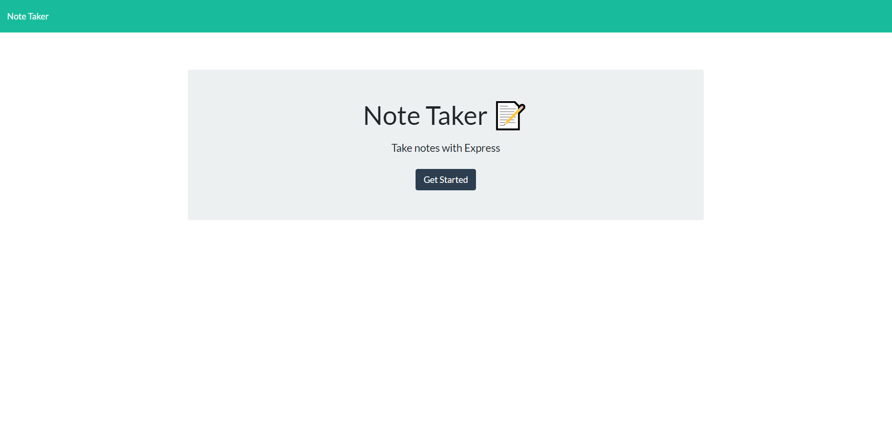
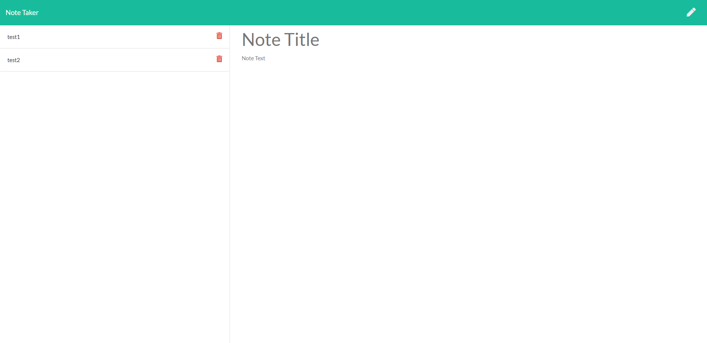

# Note Taker


## Description
For homework assignment 11 I was tasked with creating the back end code for a note taker application. With this app you are easily able to create, edit, and delete notes as you please. The app can be hosted locally or run from the link provided below on Heroku.  

To view this app live please click **[Here](https://note-taker-uoft.herokuapp.com/notes)**

## Table Of Contents
- [Installation](#Installation)
- [Usage](#Usage)
- [Screenshots](#Screenshots)
- [Questions](#Questions)
- [License](#License)

## Installation
This application is easy to install, just clone the repository and run the following command in your terminal.

```
npm install
```

This will create the node modules folder you will need in order for this application to function correctly.

## Usage
To use the Note Taker app you simply press the 'Get Started' button. This will then route to the note page where you can enter a note title and the note text. Once you have typed up the title and text, a search save button will appear on the top right corner. Press that button to save your note. Your saved notes are populated on the left column of the screen. From here you are able to delete the note by clicking the garbage icon that is located to the right of it. You can click on the note and it will actively display in the center of the screen. You can edit your note and save it as a new note. You can also created a new note by clicking the pencil icon. 

## Screenshots




## Questions
To view my other repositories or to connect with me on GitHub please click **[Here](https://github.com/HustinKava/)**
If you have any questions please feel free to reach out to me at the following email: *hkavafsd@gmail.com*

## License
